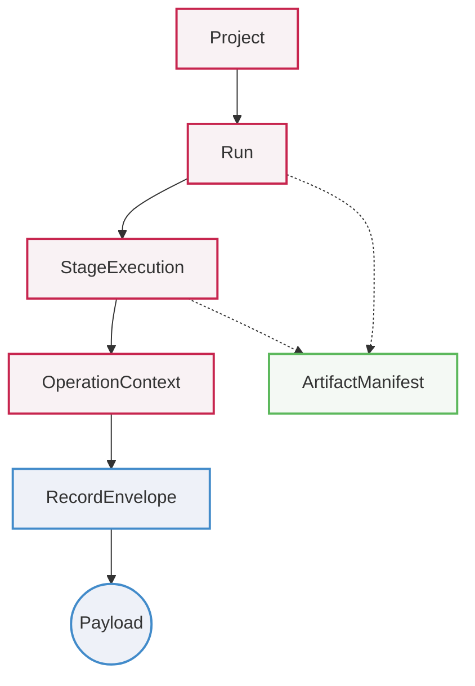

<div align="center">
  <h1>🩻 Spine</h1>
  <p><em>A Canonical Contract Library for ML Observability Systems</em></p>

  [](https://github.com/eastlighting1/Spine/actions/workflows/ci.yml)
  [](https://github.com/eastlighting1/Spine)
  [](https://github.com/astral-sh/ruff)
  
  [**English**](./README.md) • [**한국어**](./README.ko.md)
</div>

---

**Spine** gives teams a shared model for execution context, observability records, artifacts, lineage, validation, deterministic serialization, and compatibility-aware reading. 

Instead of letting each producer invent its own payload shape, Spine provides **one single contract** for building, validating, serializing, and re-reading the same kinds of objects consistently across your entire ML pipeline.

## ❓ Why Spine

ML systems usually drift and break down in the same places:
- Run and project identity
- Metric and event payload shapes
- Timestamp normalization
- Artifact metadata
- Lineage and provenance representation
- Legacy payload handling

> **Spine exists to stop that drift at the model layer.**

With Spine, you can enforce strict models for:
- **Execution Context:** `Project`, `Run`, `StageExecution`, `OperationContext`, `EnvironmentSnapshot`
- **Observability Records:** `StructuredEventRecord`, `MetricRecord`, `TraceSpanRecord`
- **Durable Outputs:** `ArtifactManifest`
- **Semantic Relationships:** `LineageEdge`, `ProvenanceRecord`

## 🧠 Core Ideas

Spine is easiest to understand through its hierarchical data model. Execution context is strictly separated from observed facts:



### Strong Defaults

- Use `StableRef` instead of ad hoc identity strings.
- Validate objects immediately upon construction.
- Serialize into deterministic, canonical payloads.
- Treat data migration as an explicit compatibility path, not silent magic.

## 📦 Installation

Clone the repository:

```bash
git clone https://github.com/eastlighting1/Spine.git
cd Spine
```

For local development with `uv`:

```bash
uv run --with-editable . python
```

To verify the installation:

```bash
uv run --with-editable . python -c "import spine; print(spine.__file__)"
```

To run the test suite:

```bash
uv run pytest tests
```

## ⚡ Quick Start

The basic usage loop in Spine is simple: **1) Build canonical objects ➔ 2) Validate them ➔ 3) Serialize at system boundaries.**

```python
from spine import (
    MetricPayload,
    MetricRecord,
    Project,
    RecordEnvelope,
    Run,
    StableRef,
    to_json,
    validate_metric_record,
    validate_project,
    validate_run,
)

# 1. Define and Validate Context
project = Project(
    project_ref=StableRef("project", "nova"),
    name="NovaVision",
    created_at="2026-03-30T09:00:00Z",
)
validate_project(project).raise_for_errors()

run = Run(
    run_ref=StableRef("run", "train-20260330-01"),
    project_ref=project.project_ref,
    name="baseline-resnet50",
    status="running",
    started_at="2026-03-30T09:05:00Z",
)
validate_run(run).raise_for_errors()

# 2. Record an Observed Fact
metric = MetricRecord(
    envelope=RecordEnvelope(
        record_ref=StableRef("record", "metric-step-42"),
        record_type="metric",
        recorded_at="2026-03-30T09:08:30Z",
        observed_at="2026-03-30T09:08:30Z",
        producer_ref="scribe.python.local",
        run_ref=run.run_ref,
        stage_execution_ref=None,
        operation_context_ref=None,
    ),
    payload=MetricPayload(
        metric_key="training.loss",
        value=0.4821,
        value_type="scalar",
        unit="ratio",
    ),
)
validate_metric_record(metric).raise_for_errors()

# 3. Serialize Deterministically
print(to_json(metric))
```

## 📚 Documentation

Dive deeper into Spine's architecture and API:

| Guide | English | 한국어 |
|---|---|---|
| **Main Guide** | [README.md](./docs/en/README.md) | [README.md](./docs/ko/README.md) |
| **API Reference** | [api-reference.md](./docs/en/api-reference.md) | [api-reference.md](./docs/ko/api-reference.md) |

**Recommended Reading Path:**

1. [Getting Started](./docs/en/getting-started.md)
2. [Understanding Spine Models](./docs/en/understanding-spine-models.md)
3. [Context Models](./docs/en/context-models.md)
4. [Observability Records](./docs/en/observability-records.md)
5. [Artifacts And Lineage](./docs/en/artifacts-and-lineage.md)

## 🏗️ Repository Layout

- `src/spine`: Public package and implementation
- `examples`: Runnable example flows
- `tests`: Model and serialization tests
- `docs/en` & `docs/ko`: Detailed documentation

## 🚦 Current Status

This repository is currently at an early stage, but the core contract surface is fully operational:

- ✅ Canonical object modeling
- ✅ Strict schema validation
- ✅ Deterministic serialization
- ✅ Compatibility-aware reading
- ✅ Extension namespace governance